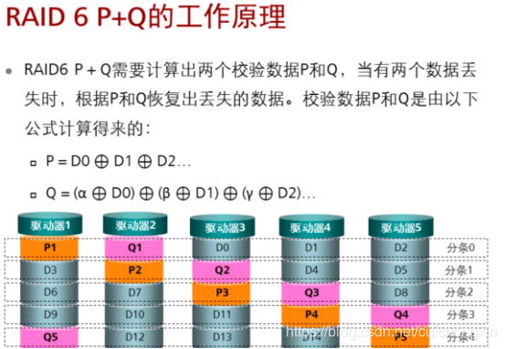
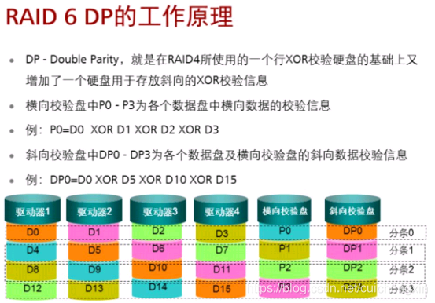

# RAID 配置和热备份（Hot Spare）

## RAID 1、RAID 5、RAID 6 配置

### 原理

#### RAID 1 (Mirroring)

* **原理**: RAID 1 通过磁盘镜像来提供数据冗余。
* **数据冗余**: 相同的数据被存储在两个不同的硬盘上。
#### RAID 5 (Striping with Parity)

* **原理**: 数据和奇偶校验信息被分布在所有磁盘上。
* **数据冗余**: 通过奇偶校验来实现。
#### RAID 6 (Striping with Double Parity)

* **原理**: 类似于 RAID 5，但提供了双重奇偶校验。
* **数据冗余**: 通过双重奇偶校验来实现。
### 用法

#### RAID 1

```bash
# 创建 RAID 1 数组
mdadm --create /dev/md0 --level=1 --raid-devices=2 /dev/sda1 /dev/sdb1
```
#### RAID 5

```bash
# 创建 RAID 5 数组
mdadm --create /dev/md0 --level=5 --raid-devices=3 /dev/sda1 /dev/sdb1 /dev/sdc1
```
#### RAID 6

```bash
# 创建 RAID 6 数组
mdadm --create /dev/md0 --level=6 --raid-devices=4 /dev/sda1 /dev/sdb1 /dev/sdc1 /dev/sdd1
```
### 具体用例解析

* **RAID 1**: 适用于需要高可用性的应用，如关键业务数据库。
* **RAID 5**: 适用于需要平衡性能和可用性的应用，如文件服务器。
* **RAID 6**: 适用于需要更高数据保护级别的应用，如金融交易系统。
### 注意事项

* **RAID 1**: 需要至少两块硬盘。
* **RAID 5**: 需要至少三块硬盘。
* **RAID 6**: 需要至少四块硬盘。

---


## 热备份（Hot Spare）

### 原理

* **原理**: 热备份是一个额外的、未使用的硬盘，用于在 RAID 数组中的一个硬盘发生故障时自动替换。
### 用法

```bash
# 添加热备份
mdadm --add /dev/md0 /dev/sde1
```
### 具体用例解析

* **用例**: 在关键业务应用中，热备份可以减少由于硬盘故障导致的系统停机时间。
### 注意事项

* 确保热备份硬盘与 RAID 数组的其他硬盘具有相同或更大的存储容量。

---
# RAID 0 在 SSD 和 C 代码中的详细应用

## RAID 0 在 SSD 中的应用

RAID 0（条带化）在 SSD 中的主要优点是性能提升。由于数据被分割成多个块（条带）并分布在多个硬盘上，因此读写操作可以并行进行，从而提高数据吞吐量。但是，RAID 0 不提供数据冗余，因此一旦其中一个硬盘失败，所有数据都将丢失。

### 优点：

1. **性能提升**: 由于多个 SSD 可以并行工作，因此读写速度得到显著提升。
2. **容量最大化**: 所有 SSD 的存储空间都用于数据存储，没有冗余。
### 缺点：

1. **没有数据冗余**: 一旦一个硬盘失败，所有数据都会丢失。
2. **数据恢复困难**: 由于没有冗余，数据恢复几乎不可能。
## C 代码实现

在 C 语言中，实现 RAID 0 主要涉及到数据的条带化和分布。以下是一个简单的示例：

```plain
#include <stdio.h>
#include <string.h>

const char *disk1 = "disk1.bin";
const char *disk2 = "disk2.bin";

void write_to_disks(const char *data, size_t length) {
    FILE *fp1 = fopen(disk1, "wb");
    FILE *fp2 = fopen(disk2, "wb");

    for (size_t i = 0; i < length; i++) {
        if (i % 2 == 0) {
            fwrite(&data[i], 1, 1, fp1);
        } else {
            fwrite(&data[i], 1, 1, fp2);
        }
    }

    if (fp1) fclose(fp1);
    if (fp2) fclose(fp2);
}

int main() {
    const char *data = "Hello, RAID 0!";
    write_to_disks(data, strlen(data));
    return 0;
}
```
这个例子非常基础，仅用于演示 RAID 0 的数据条带化原理。在实际应用中，需要考虑更多的因素，比如磁盘同步、错误处理、性能优化等。
## 在 SSD 中的具体实现

在 SSD 中实现 RAID 0 通常涉及到底层的硬件操作，特别是与 SSD 控制器的交互。这通常是通过发送 ATA 或 NVMe 命令来完成的。

例如，如果您使用的是支持 NVMe 的 SSD，您可能需要使用 NVMe 的相关 API 或驱动程序接口来发送读/写命令。

```plain
// 伪代码，用于演示如何使用 NVMe API 写入数据到两个 SSD
void nvme_write_to_disks(const char *data, size_t length) {
    nvme_command write_cmd1, write_cmd2;
    // 初始化 NVMe 命令
    // ...
    nvme_submit_command(ssd1, &write_cmd1);
    nvme_submit_command(ssd2, &write_cmd2);
}
```
请注意，这里的代码是为了演示目的而简化的。在实际应用中，需要处理更多的细节和错误情况。
## 总结

RAID 0 主要用于提高性能和最大化存储容量，但它不提供数据冗余。在 SSD 中，RAID 0 可以进一步提高数据读写速度，但也带来了数据丢失的风险。

# 
# RAID 1 在 SSD 和 C 代码中的详细应用

## 在 SSD 中的应用

SSD（固态硬盘）由于其高速性能，经常用于需要高 I/O 吞吐量和低延迟的应用场景。在 SSD 中使用 RAID 1，特别是在企业级应用中，可以提供以下几个优点：

1. **数据冗余**: 通过镜像，即使一块 SSD 失效，数据也不会丢失。
2. **读取性能**: RAID 1 允许从多个 SSD 驱动器并行读取，从而提高读取性能。
3. **快速故障恢复**: 在 SSD 中，由于读写速度快，RAID 1 的重建时间相对更短。
## C 代码实现

在 C 语言中，实现 RAID 1 的逻辑相对直接。下面是一个简单的示例，展示了如何将数据写入两个不同的 "硬盘"（在这里，我们用文件模拟硬盘）。

```plain
#include <stdio.h>
#include <string.h>

// 模拟硬盘文件路径
const char *disk1 = "disk1.bin";
const char *disk2 = "disk2.bin";

void write_to_disks(const char *data, size_t length) {
    FILE *fp1 = fopen(disk1, "wb");
    FILE *fp2 = fopen(disk2, "wb");

    if (fp1 && fp2) {
        fwrite(data, 1, length, fp1);
        fwrite(data, 1, length, fp2);
    }

    if (fp1) fclose(fp1);
    if (fp2) fclose(fp2);
}

int main() {
    const char *data = "Hello, RAID 1!";
    write_to_disks(data, strlen(data));
    return 0;
}
```
这个例子非常基础，仅用于演示 RAID 1 的数据镜像原理。在实际应用中，需要考虑更多的因素，比如磁盘同步、错误处理、性能优化等。
## 在 SSD 中的具体实现

在 SSD 中实现 RAID 1 涉及到更底层的硬件操作，通常需要与 SSD 控制器进行交互。这通常是通过发送 ATA 或 NVMe 命令来完成的。具体的实现细节取决于您使用的 SSD 和控制器的型号和规格。

例如，如果您使用的是支持 NVMe 的 SSD，您可能需要使用 NVMe 的相关 API 或驱动程序接口来发送读/写命令。

```plain
// 伪代码，用于演示如何使用 NVMe API 写入数据到两个 SSD
void nvme_write_to_disks(const char *data, size_t length) {
    nvme_command write_cmd1, write_cmd2;
    // 初始化 NVMe 命令
    // ...
    nvme_submit_command(ssd1, &write_cmd1);
    nvme_submit_command(ssd2, &write_cmd2);
}
```
请注意，这里的代码是为了演示目的而简化的。在实际应用中，需要处理更多的细节和错误情况。
## 注意

1. RAID 1的两个硬盘必须具有相同的大小。如果两个硬盘的容量大小不同，可用容量是最小的硬盘的容量。 坏一块盘数据不会丢失，2块同时坏，数据将丢失。
2. RAID 0采用条带化技术将不同数据并行写入到硬盘中，而RAID 1则是同时写入相同的数据到每个硬盘，数据在所有成员硬盘中都是相同的。在上图所示，数据块D0，D1和D2，等待写入到硬盘。D0和D0的副本同时写入到两个硬盘中（硬盘1和硬盘2），其他数据块也以相同的方式（镜像）写入到RAID 1硬盘组中。
3. 通常来说，一个RAID 1的写性能是单个硬盘的写性能。
4. RAID 1读取数据时，会同时读取数据盘和镜像盘，以提高读取性能。如果其中一个硬盘失败，可以从另一个硬盘读取数据。
5. RAID 1系统的读取性能等于两个硬盘的性能之和。在RAID组降级的情况下，性能下降一半。

# RAID 3 在 SSD 和 C 代码中的详细应用

## RAID 3 在 SSD 中的应用

RAID 3 使用条带化（striping）和专用奇偶校验磁盘来实现数据冗余。这种配置在 SSD 中可以提供高度的数据读写性能，同时也提供了一定程度的数据保护。

### 优点：

1. **高吞吐量**: 由于多个条带 可以并行工作，因此读写速度得到显著提升。
2. **数据冗余**: 通过专用的奇偶校验磁盘，可以在某个 SSD 失效时恢复数据。
### 缺点：

1. **存储效率低**: 需要一个专用的 条带 来存储奇偶校验信息。
2. **写入性能较低**: 每次写入都需要更新奇偶校验信息。
3. AID 3的性能不是固定的。原则上，RAID 3采用的是N+1的数据保护方法。这意味着当有N个硬盘的用户数据需要保护时，需要一个额外的硬盘来存储校验信息。在这种情况下，新的数据块被写入硬盘同时，奇偶校验信息被计算生成后，写入校验硬盘。
4. 通常情况下，RAID 3组的所有的硬盘会在分条过程中合作，N个硬盘会并行写入。但当新写入的数据较少，只需写入一个或两个硬盘时，按照RAID 3的工作原理，仍需要读所有的硬盘以便重新计算新的奇偶校验值。这种少量写入数据的场景，因为需要额外的读和写操作，相对于对单个硬盘进行数据写入，并没有提升硬盘的性能，这种情况被称为RAID 3的“写惩罚”。
5. RAID 3的写入性能取决于更改数据的数量、硬盘的数目、以及计算和存储奇偶校验信息所需的时间。假定一个RAID 3的硬盘数为N，当所有成员盘的转速相同时，在不考虑写惩罚，满分条写的情况下，RAID 3的顺序IO写性能理论上略小于 N-1倍单个硬盘的性能（计算冗余校验需要额外的计算时间）。
6. ## C 代码实现

下面是一个使用 C 语言实现 RAID 3 的简单示例。这里，我们假设有三个磁盘文件（`disk1.bin`, `disk2.bin`, `parity_disk.bin`）。

```plain
#include <stdio.h>
#include <string.h>

const char *disk1 = "disk1.bin";
const char *disk2 = "disk2.bin";
const char *parity_disk = "parity_disk.bin";

void write_to_disks(const char *data, size_t length) {
    FILE *fp1 = fopen(disk1, "wb");
    FILE *fp2 = fopen(disk2, "wb");
    FILE *fp_parity = fopen(parity_disk, "wb");

    char parity;

    for (size_t i = 0; i < length; i += 2) {
        // 写入数据到 disk1 和 disk2
        fwrite(&data[i], 1, 1, fp1);
        fwrite(&data[i + 1], 1, 1, fp2);

        // 计算奇偶校验
        parity = data[i] ^ data[i + 1];

        // 写入奇偶校验到专用磁盘
        fwrite(&parity, 1, 1, fp_parity);
    }

    fclose(fp1);
    fclose(fp2);
    fclose(fp_parity);
}

int main() {
    const char *data = "Hello, RAID 3!";
    write_to_disks(data, strlen(data));
    return 0;
}
```

## 在 SSD 中的具体实现：经典用例：高性能数据库系统

在一个高性能数据库系统中，读写速度和数据冗余是非常关键的。在这种场景下，RAID 3 可以非常有效地平衡这两个需求。

### 系统架构

* **SSD1、SSD2**: 存储实际的数据库文件。
* **Parity****SSD**: 存储奇偶校验信息。
* **Controller**: 一个硬件或软件控制器，负责管理所有的 SSD 和实现 RAID 3。
### 数据写入流程

1. **接收写入请求**: 当数据库需要写入一条新的记录时，控制器会接收到一个写入请求。
2. **数据分割**: 控制器将数据分割成多个小块。
3. **计算奇偶校验**: 控制器计算每一块数据的奇偶校验。
4. **并行写入**: 控制器将数据块和奇偶校验块并行写入到 SSD1、SSD2 和 Parity SSD。
### C 代码示例

这是一个简化的 C 代码示例，用于模拟上述数据写入流程。

```plain
#include <stdio.h>
#include <string.h>

// 模拟 SSD 写入操作
void write_to_ssd(const char *ssd_name, const char *data, size_t length) {
    FILE *fp = fopen(ssd_name, "wb");
    fwrite(data, 1, length, fp);
    fclose(fp);
}

// 模拟 RAID 3 写入操作
void raid3_write(const char *data, size_t length) {
    char data1[length / 2];
    char data2[length / 2];
    char parity[length / 2];

    // 数据分割
    for (size_t i = 0, j = 0; i < length; i += 2, j++) {
        data1[j] = data[i];
        data2[j] = data[i + 1];
    }

    // 计算奇偶校验
    for (size_t i = 0; i < length / 2; i++) {
        parity[i] = data1[i] ^ data2[i];
    }

    // 写入到 SSD
    write_to_ssd("SSD1.bin", data1, length / 2);
    write_to_ssd("SSD2.bin", data2, length / 2);
    write_to_ssd("Parity_SSD.bin", parity, length / 2);
}

int main() {
    const char *data = "Hello, High-Performance Database!";
    raid3_write(data, strlen(data));
    return 0;
}
```
### 注意事项

1. **数据恢复**: 在 SSD 失效的情况下，需要有一个快速的数据恢复机制。
2. **性能监控**: 由于 RAID 3 的写入性能可能不如其他 RAID 配置，因此需要密切监控系统性能。
3. **硬件兼容性**: 确保所有 SSD 和控制器都支持 RAID 3 配置。
## 总结

RAID 3 在 SSD 中提供了高度的读写性能和数据冗余。通过使用专用的奇偶校验磁盘，RAID 3 能在某个 SSD 失效时恢复数据。然而，由于需要一个专用的 SSD 来存储奇偶校验信息，存储效率相对较低。

# RAID 5 在 SSD 中的深入分析

## 原理和算法

RAID 5 使用条带化（striping）和奇偶校验（parity）的组合。数据被分割成多个块，并与奇偶校验块一起存储在多个 SSD 上。奇偶校验块是通过 XOR 运算从数据块中生成的。

### 算法步骤

1. **数据分割**: 将要写入的数据分割成多个小块。
2. **奇偶校验计算**: 对每个数据块进行 XOR 运算以生成奇偶校验块。
3. **数据和校验写入**: 将数据块和奇偶校验块写入不同的 SSD。
## 主要功能和优点

* **数据冗余**: 即使一块 SSD 失效，也能通过其他 SSD 和奇偶校验块恢复数据。
* **性能优化**: 多个读写操作可以并行进行，提高 I/O 性能。
    * 在RAID 5中，数据以分条的形式写入硬盘组中。硬盘组中的每个硬盘都存储数据块和校验信息，数据块写一个分条时，奇偶信息被写入相应的校验硬盘。在RAID 5进行连续写入的时候，不同分条用来存储奇偶校验的硬盘是不同的。因此RAID 5的不同分条的奇偶校验数据不是单独存在一个固定的校验盘里的，而是按一定规律分散存放的。
    * RAID 3在少量的数据被写入时有写惩罚，RAID 5类似。
    * RAID 5的写入性能取决于所写的数据量和RAID 5组中硬盘的数量。假定一个RAID 5的硬盘数为N，当所有成员盘的转速相同时，在不考虑写惩罚，满分条写的情况下，RAID 5的顺序IO写性能理论上略小于 N-1倍单个硬盘的性能（计算冗余校验需要额外的计算时间）。
* **扩展性**: 可以容易地添加更多的 SSD。
## 使用方法和配置

### 硬件和软件需求

* 至少三块 SSD
* RAID 控制器或软件 RAID 工具
### 配置步骤

1. 使用 RAID 控制器或操作系统提供的工具进行 RAID 5 配置。
2. 格式化 RAID 阵列。
3. 验证 RAID 阵列的状态和性能。
## C 代码实现

下面的 C 代码示例展示了如何在三块 SSD 上实现 RAID 5 的写操作。

```plain
#include <stdio.h>
#include <stdlib.h>

// 模拟写入 SSD
void write_to_ssd(const char *filename, char *data, size_t size) {
    FILE *fp = fopen(filename, "wb");
    fwrite(data, 1, size, fp);
    fclose(fp);
}

// RAID 5 写操作
void raid5_write(char *data, size_t size) {
    size_t chunk_size = size / 3;
    char *ssd1 = malloc(chunk_size);
    char *ssd2 = malloc(chunk_size);
    char *ssd3 = malloc(chunk_size);
    char *parity = malloc(chunk_size);

    // 数据分割和奇偶校验计算
    for (size_t i = 0; i < chunk_size; ++i) {
        ssd1[i] = data[i];
        ssd2[i] = data[i + chunk_size];
        ssd3[i] = data[i + 2 * chunk_size];
        parity[i] = ssd1[i] ^ ssd2[i] ^ ssd3[i];
    }

    // 写入 SSD
    write_to_ssd("ssd1.bin", ssd1, chunk_size);
    write_to_ssd("ssd2.bin", ssd2, chunk_size);
    write_to_ssd("ssd3.bin", ssd3, chunk_size);
    write_to_ssd("parity.bin", parity, chunk_size);

    free(ssd1);
    free(ssd2);
    free(ssd3);
    free(parity);
}

int main() {
    char data[] = "This is RAID 5 data";
    raid5_write(data, sizeof(data) - 1);
    return 0;
}
```
## 注意事项

1. **数据恢复**: 如果一个 SSD 失效，需要立即替换并重建数据。
2. **性能监控**: 由于 RAID 5 在写入时需要额外的奇偶校验计算，可能会影响性能。
3. **硬件兼容性**: 确保所有 SSD 和控制器都支持 RAID 5。
### 应用和经典用例

RAID 5 在 SSD 中的应用非常广泛，尤其是在需要高度数据可靠性和性能的环境中。下面是一些更详细的应用场景和经典用例。

#### 1. 数据中心和云存储

在数据中心和云存储环境中，RAID 5 常用于存储大量的用户数据。这些数据中心通常需要在短时间内处理大量的读写请求，而 RAID 5 可以提供这样的性能。

**经典用例**: 在 AWS 或 Azure 的云存储解决方案中，RAID 5 可用于存储用户上传的文件和数据库。这不仅提供了数据冗余，还优化了数据读取性能。

#### 2. 企业级数据库系统

企业级数据库系统，如 Oracle 或 SQL Server，通常存储在 SSD 阵列上。这些数据库需要快速的读写速度和高可用性。

**经典用例**: 在金融交易系统中，数据库需要在毫秒级别内完成交易。使用 RAID 5，可以确保即使在一块 SSD 失效的情况下，系统仍能正常运行。

#### 3. 大数据和分析

大数据分析通常涉及到对大量数据的读取。RAID 5 可以提供足够的吞吐量来满足这些需求。

**经典用例**: 在物流和供应链管理中，大数据分析用于追踪货物流动。RAID 5 确保了数据的完整性和可用性。

#### 4. 媒体和娱乐行业

在媒体和娱乐行业，如电影制作或游戏开发，需要大量的存储空间和高速的读写能力。

**经典用例**: 在电影后期制作中，编辑需要访问数TB大小的原始视频文件。RAID 5 不仅提供了足够的存储空间，还确保了高速的文件访问。

#### 5. 数据恢复

RAID 5 是一种常用的数据恢复解决方案。当一块 SSD 失效时，可以通过其他 SSD 上的数据和奇偶校验块来恢复丢失的数据。

**经典用例**: 在灾难恢复中，如果数据中心遭受火灾或洪水侵袭，RAID 5 阵列可以用于快速恢复关键数据，从而减少业务中断的时间。

### 注意事项

1. **数据恢复速度**: 虽然 RAID 5 提供了一定程度的数据冗余，但数据恢复速度可能会受到影响，特别是在大容量 SSD 中。
2. **写入惩罚**: 由于需要计算奇偶校验，RAID 5 在写操作上有一定的性能损失。
3. **SSD 磨损均衡**: 在 SSD 阵列中使用 RAID 5 时，需要注意 SSD 的磨损均衡，以延长其使用寿命。
# RAID 6：更详细的分析

## 原理

RAID 6 是一种冗余磁盘阵列配置，它使用两个奇偶校验块（P 和 Q）以及一个双奇偶校验（DP）来提供数据冗余。这意味着即使两个磁盘同时失败，数据也能被完全恢复。

### 算法原理

* **P 奇偶校验**: 通过异或（XOR）操作计算。
* **Q 奇偶校验**: 使用更复杂的数学运算（通常是基于伽罗华域的 Reed-Solomon 码）。



* **DP (Double Parity)**: 使用更高级的数学运算，通常是基于 Reed-Solomon 码的扩展。



## 主要功能

* **数据冗余**: 可以容忍两个磁盘的同时故障。
* **读取性能**: 读取性能优秀，因为可以并行读取多个磁盘。
* **写入性能**: 相对较低，因为需要计算两个奇偶校验块和一个双奇偶校验块。
## 使用方法

1. **选择磁盘**: 至少需要 5 块磁盘（包括两个奇偶校验磁盘和一个双奇偶校验磁盘）。
2. **配置 RAID**: 使用硬件 RAID 控制器或软件工具进行配置。
3. **数据分布**: 数据会被均匀地分布在所有磁盘上，除了两个用于奇偶校验和一个用于双奇偶校验的磁盘。
## 在 SSD 中的具体实现：经典用例

### 经典用例：大规模数据中心

在大规模数据中心中，数据的安全性和可用性是至关重要的。RAID 6 由于其高度的数据冗余，成为了一种理想的选择。

#### C 代码示例

```plain
#include <stdio.h>
#include <string.h>

// 模拟 RAID 6 写入操作，包括 DP
void raid6_write_with_dp(const char *data, size_t length) {
    char data1[length / 5];
    char data2[length / 5];
    char parityP[length / 5];
    char parityQ[length / 5];
    char parityDP[length / 5];  // 双奇偶校验

    // 数据分割
    for (size_t i = 0, j = 0; i < length; i += 5, j++) {
        data1[j] = data[i];
        data2[j] = data[i + 1];
    }

    // 计算 P、Q 和 DP 奇偶校验（简化版）
    for (size_t i = 0; i < length / 5; i++) {
        parityP[i] = data1[i] ^ data2[i];
        parityQ[i] = data1[i] + data2[i];  // 这里使用加法作为简化的 Q 奇偶校验
        parityDP[i] = data1[i] - data2[i]; // 这里使用减法作为简化的 DP 奇偶校验
    }

    // 写入到 SSD
    // 这里应该调用实际的 SSD 写入函数
    printf("Writing to SSD1: %s\n", data1);
    printf("Writing to SSD2: %s\n", data2);
    printf("Writing to ParityP SSD: %s\n", parityP);
    printf("Writing to ParityQ SSD: %s\n", parityQ);
    printf("Writing to ParityDP SSD: %s\n", parityDP);  // 双奇偶校验
}

int main() {
    const char *data = "DataCenter";
    raid6_write_with_dp(data, strlen(data));
    return 0;
}
```
### 注意事项

1. **数据恢复**: 在 SSD 失效的情况下，数据恢复可能会更复杂和耗时。
2. **性能监控**: 由于写入性能可能较低，需要密切监控性能指标。
3. **硬件和软件兼容性**: 确保所有 SSD 和 RAID 控制器都支持 RAID 6 和 DP。


